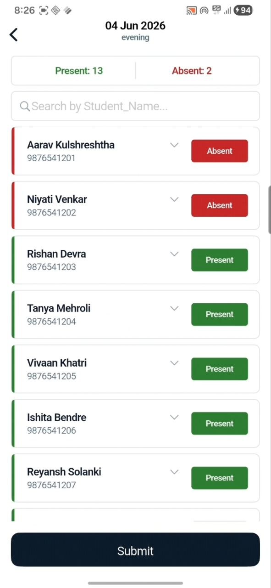

<p align="center">
  
  
  
  
  
</p>

<h5 align="center">AttendAce — offline attendance management</h5>

Import any `.xlsx` roll sheet, take date-tagged attendance sessions, edit and export.

---

<p align="center">
  <a href="https://github.com/PrakharMishra531/attendace/blob/main/screenshare.mp4">
    
  </a>
</p>

## Use Case

- You have a class list in Excel
- You take attendance daily — manually marking paper, or typing into a spreadsheet
- You want to mark present/absent on your phone, session by session, and export the updated sheet back

---

## How It Works

1. **Import** an `.xlsx` file — the app detects headers, shows you a preview, lets you pick a primary column
2. **Create sessions** for each attendance date (with optional tags like "Morning", "Lab")
3. **Toggle** each student as present/absent with a single tap
4. **Export** the enriched sheet — `P` (present) and `A` (absent) merged into the original data

No internet. No accounts. All local.

---

## Install

Download the `.apk` from the **[Releases page](../../releases)** and sideload.

---

## Stack

- **Flutter 3.44** + **Dart 3.12** — cross-platform mobile
- **Drift** + **SQLite** — local persistence with typed queries
- **Riverpod** — state management
- **GoRouter** — declarative routing
- **archive** + **xml** — custom `.xlsx` parser (no cloud dependencies)
- **excel** — `.xlsx` export with styled cells
- **Cupertino** — iOS-native UI (white mode, navy accents)

---

## Dev

```bash
git clone https://github.com/PrakharMishra531/attendace.git && cd attendace
flutter pub get
dart run build_runner build   # generate drift files
flutter run
```

---

Built with opencode + deepseek v4 pro.
